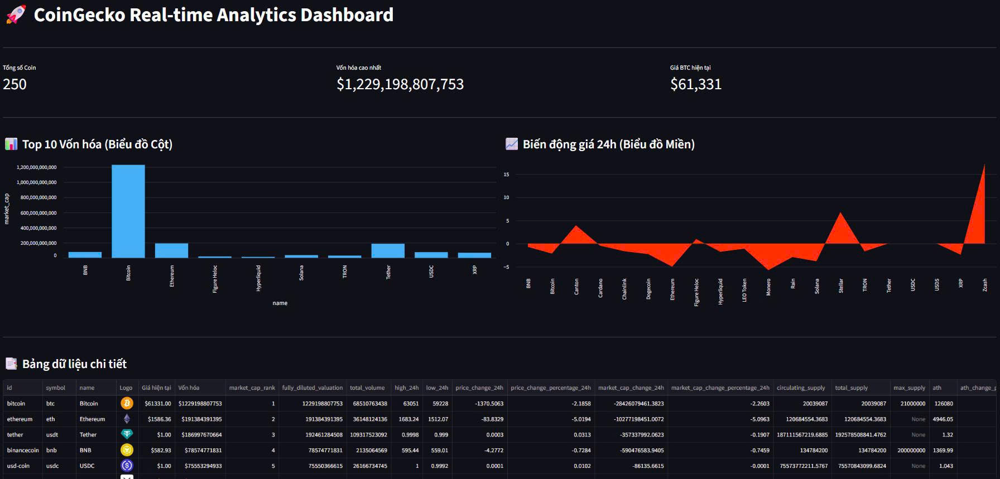

# coingecko-etl-pipeline
An end-to-end ETL Pipeline to extract cryptocurrency data from CoinGecko API, clean and transform using Pandas, and load into PostgreSQL database with automated logging and error handling.
[](https://coingecko-etl-pipelinegitappapppy-fyysrzcejht5uyagjzu4zm.streamlit.app/)
*(Click vào biểu tượng trên để xem trực tiếp Bảng điều khiển Dữ liệu)*

📸 **Giao diện Dashboard thực tế:**


## 💻 Hướng dẫn chạy dự án trên máy cá nhân (Local)
**1. Clone dự án về máy:**
```bash
git clone [https://github.com/Otis308/coingecko-etl-pipeline.git](https://github.com/Otis308/coingecko-etl-pipeline.git)
cd coingecko-etl-pipeline
